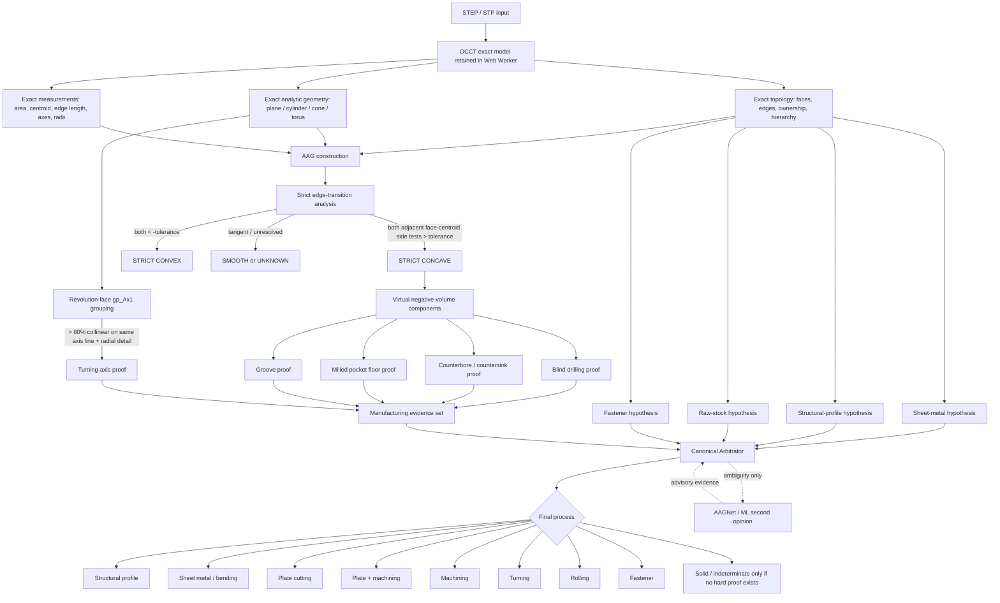

# NavoFlo V8.22.0 — Complete Manufacturing Analysis Pipeline

## Design rule

No individual detector is allowed to decide the final manufacturing process by itself. Geometry readers produce **evidence**; the Canonical Arbitrator produces the final decision. AAGNet/ML remains advisory unless its face mapping is exact and it confirms, rather than contradicts, exact B-Rep proof.

## 1. STEP ingestion and exact B-Rep

`public/js/step-worker.js`

The STEP file is opened locally with OCCT-js. The worker retains an exact model handle and exposes one Navo3D geometry for each STEP shape/occurrence. For manufacturing analysis it returns:

- face ID and analytic family;
- exact face area and centroid;
- plane normal when available;
- revolution axis (`gp_Ax1` equivalent through `axisDirection` + axis location);
- cylinder radius and axial span;
- exact hole / compound-hole descriptors when OCCT recognizes them;
- edge ID, owner faces, exact length and end points;
- AAG neighbor relationships;
- same-domain healing groups.

## 2. Strict transition classification on AAG edges

V8.22.0 adds transition semantics to every two-owner manufacturing edge:

- `transition = concave | convex | smooth | unknown`
- `strictConcave`
- `strictConvex`
- `normalDot`
- `normalAngleDeg`
- signed side tests (`sideAB`, `sideBA`)

The worker evaluates the outward exact normals of the two owner faces at the shared edge. It then compares each adjacent face centroid with the other face's oriented tangent plane at the edge.

A transition is **STRICTLY CONCAVE only when both signed tests are positive beyond a scale-dependent tolerance**. Mixed or numerically marginal cases remain `unknown`; they are never promoted to machining merely because the surface family looks like a pocket/groove.

## 3. Virtual negative volumes

`public/js/manufacturing-machining-evidence.js`

Strictly concave AAG edges form a subgraph. Connected face sets in this subgraph become `neg-*` virtual negative-volume components. Each component stores:

- participating face IDs;
- strict concave edge IDs;
- analytic surface families;
- total participating face area.

This represents **topologically proven removed-material cavities**. V8.22.0 intentionally does not claim a full Boolean volume value yet; stock reconstruction + OCCT Boolean subtraction remains a future independent layer.

## 4. Blind drilling / counterbore / countersink

A blind drilled volume is promoted when a cylindrical wall has a **strictly concave transition to a planar bottom**, with exact `DescribeExactHole` evidence taking priority when present.

A compound hole is promoted when:

- OCCT returns an exact compound-hole descriptor; or
- multiple coaxial cylindrical radii belong to the same negative-volume component with a strict concave planar shoulder.

Cylinder -> cone strict concavity on the same axis line is treated as countersink/compound drilling evidence rather than an external bevel.

## 5. Milling pocket

A planar face becomes a pocket floor only when:

1. it belongs to a negative-volume component;
2. at least two independent wall faces meet it through strictly concave transitions;
3. those walls are perpendicular/curved relative to the floor rather than same-domain skin fragments.

The emitted feature carries:

- `topologyProven: true`
- `concavityProven: true`
- `negativeVolume: true`
- exact strict-concave edge IDs.

## 6. Grooves

A recessed cylindrical/toroidal face bounded by multiple strict concave transitions becomes groove evidence. If the global revolution-axis proof is active, the groove is emitted as a turning feature; otherwise it remains a milling/secondary-machining groove.

This restores the intended distinction between a simple laser-cut disk and a puck/disk with a real machined groove.

## 7. Turning by gp_Ax1 collinearity

All revolution faces (`CYLINDER`, `CONE`, `TORUS`) are grouped by their exact axis line, not merely by parallel direction.

Turning is proven only when:

- at least three revolution faces exist;
- **strictly more than 80%** of all revolution faces share the same `gp_Ax1` line;
- the dominant group contains real radial detail: multiple radii and/or cone/torus surfaces.

This rejects perforated plates (parallel hole axes at different centers) and structural profile root fillets, while strongly recognizing stepped shafts such as `ST01-0002`.

## 8. Raw-stock / sheet / structural / fastener hypotheses

These remain independent:

- Sheet-metal engine proves constant thickness, true paired inner/outer bend cylinders and unfold capability.
- Structural profile engine proves longitudinal section invariance and AISC shape matching.
- Raw-stock engine estimates round bar, flat/plate, rectangular or hex stock.
- Fastener recognizer excludes proven standard hardware from plate/profile machining classification.

A structural-profile proof has authority over concavity-only root fillets. Therefore a W/C/L/U section is not considered machined just because its rolled root radius is concave. Exact drilled/compound holes may still be retained as secondary operations.

## 9. Canonical Arbitrator

`public/js/manufacturing-critical-arbitrator.js`

The arbitrator evaluates all hard evidence together.

Important V8.22.0 rule:

> If constant sheet thickness is not proven and one or more strict-concavity negative-volume machining proofs exist, the analysis may no longer terminate as `Solid / indeterminate`.

Decision priority relevant to machining:

1. Proven structural stock remains structural stock; concavity-only stock fillets are ignored as machining.
2. Proven turning axis + machining evidence -> `Turning`.
3. Plate stock + hard concave machining evidence -> `Plate + machining`.
4. Other stock/solid + hard concave drilling/milling evidence -> `Machining`.
5. No hard proof -> keep stock/profile/solid hypothesis; ML may be requested as a second opinion.

## 10. ML / AAGNet

ML remains downstream of exact geometry. An advisory AAGNet face label cannot convert a clean plate into a machined part by itself. It may raise `possibleMachining` and trigger review. Exact B-Rep concavity, exact holes and gp_Ax1 proof take precedence.

## 11. Performance gates

- Sheet-metal preflight stays lightweight.
- Strict concavity is calculated only during the full manufacturing-face pass.
- Two-owner edges only are evaluated.
- Unknown/marginal transition cases are not retried as heuristic machining.
- Assembly analysis remains per geometry/part rather than treating the whole assembly as one solid.
- Analysis cache version is bumped to V13 so prior classifications are recomputed once.

## 12. Regression contract

V8.22.0 adds `tests/v8220-machining-aag-concavity.mjs` and retains every earlier MRE/profile/stability test. The new contract verifies:

- strict concave pocket floor -> milling;
- cylinder -> planar bottom -> blind hole;
- stepped coaxial cylinders -> counterbore;
- gp_Ax1 rule is **>80%**, not >=80%;
- strict concavity + no constant thickness cannot end as Solid;
- plate stock + concavity -> Plate + machining;
- structural stock authority suppresses false root-fillet machining.
