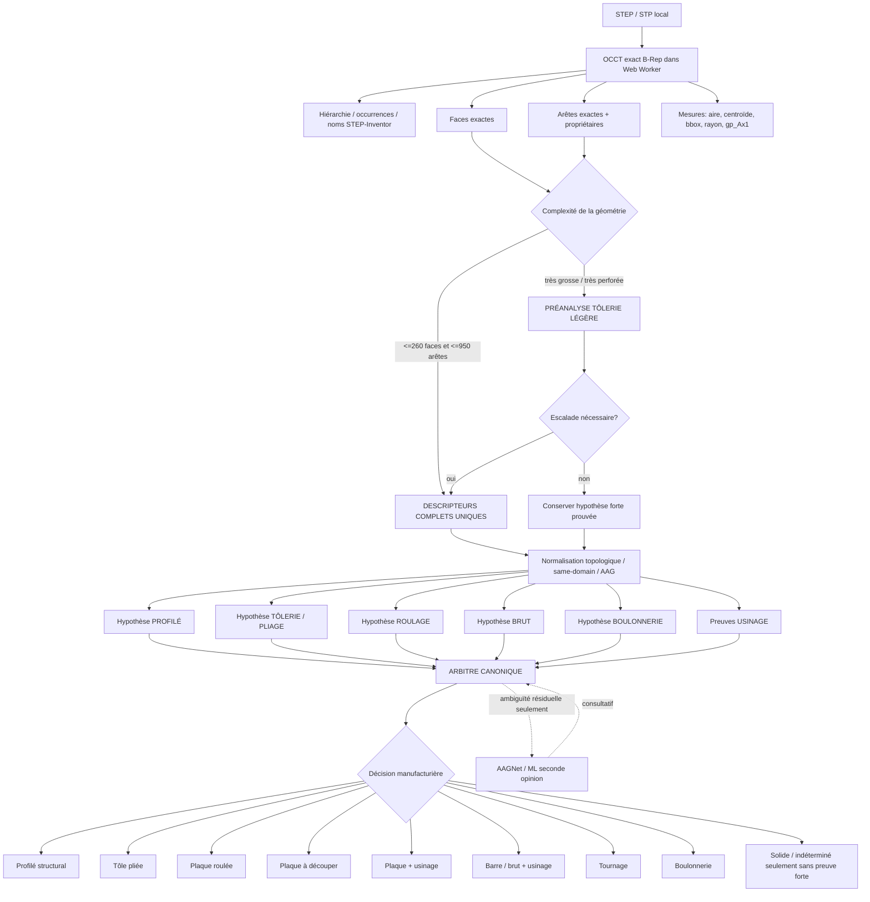

# NavoFlo V8.23.0 — Schéma complet du moteur d'analyse manufacturière

## Principe directeur

V8.23.0 remplace la logique « le premier détecteur qui répond gagne » par un pipeline à **preuves partagées**. Pour une pièce de complexité normale, les hypothèses tôlerie, profilé, brut et usinage utilisent **le même jeu de descripteurs B-Rep exacts**. Pour les très gros STEP/perforés, une préanalyse légère reste permise, mais une preuve forte déjà établie ne peut plus être effacée par un enrichissement générique qui échoue.

Aucune étiquette ML/AAGNet ne peut renverser une preuve géométrique exacte.



---

## 1. Ingestion STEP et B-Rep exact

### Fichiers principaux

- `public/js/step-worker.js`
- `public/js/viewer.js`

Le STEP reste local. OCCT-js conserve le modèle exact et retourne, selon la profondeur d'analyse demandée :

- ID et famille analytique de chaque face : `PLANE`, `CYLINDER`, `CONE`, `TORUS`, B-Spline, etc.;
- aire et centroïde exacts;
- normale des plans;
- axe de révolution complet (`gp_Ax1` logique : direction + position de la ligne d'axe);
- rayons, spans et dimensions analytiques;
- trous / trous composés exacts lorsqu'OCCT peut les décrire;
- arêtes, longueur, extrémités, propriétaires et voisinage AAG;
- regroupements same-domain pour neutraliser les faces artificiellement fragmentées par l'export STEP;
- hiérarchie et noms provenant de l'assemblage.

Ces données sont des **preuves**, pas encore une décision de procédé.

---

## 2. Politique de profondeur d'analyse

### Fichier

`public/js/manufacturing-analysis-policy.js`

V8.23.0 introduit deux routes contrôlées.

### Route A — pièce normale

Si :

- `faces <= 260`, et
- `arêtes <= 950`,

Navo3D demande immédiatement `manufacturing-face-info` et **tous les moteurs utilisent exactement ces mêmes descripteurs complets**.

C'est la route utilisée par les pièces réelles de régression actuelles : W, angle, U, `503-00-01`, `ST13-0011`, `ST01-0002`, pucks ST04, etc.

### Route B — pièce énorme/perforée

Pour éviter de rendre Navo3D inutilisable sur des STEP contenant des centaines/milliers de faces, la première passe utilise `sheetmetal-face-info`.

Si un indice de conflit apparaît, la pièce est enrichie avec le jeu complet. La fonction `choosePreservedGeometryHypothesis()` interdit ensuite qu'une preuve forte déjà obtenue — profilé structural, roulage ou vrai pliage — soit remplacée par un simple échec générique de la seconde passe.

### Pourquoi cette couche existe

Avant V8.23.0, les deux routes pouvaient produire deux vérités différentes : la préanalyse ne contenait volontairement **aucun `edgeInfo` exact**, alors que certains détecteurs en dépendaient. Un W/C/L/U pouvait donc être vu comme tôle dans la passe rapide et comme profilé dans la passe complète, selon l'ordre d'exécution.

---

## 3. Hypothèse profilé structural — invariance de section avant pliage

### Fichier

`public/js/sheetmetal-engine.js`

Le moteur cherche un axe longitudinal dominant et des traces longitudinales constantes. Les arêtes droites sont reconnues selon deux niveaux :

1. métadonnée OCCT exacte `LINE` lorsqu'elle existe;
2. **fallback géométrique sûr** sur les points bruts/tessellés lorsque la préanalyse légère n'a pas d'`edgeInfo`.

Ce deuxième niveau est essentiel : la route rapide ne peut plus désactiver silencieusement la détection des profilés.

### Preuves de profilé

- section essentiellement invariante le long de l'axe;
- au moins quatre traces longitudinales cohérentes;
- section ouverte/fermée cohérente;
- dimensions et aire de section compatibles;
- comparaison AISC lorsque disponible;
- nom Inventor/STEP utilisé comme indice, jamais comme preuve unique.

### Priorité structurale

Une preuve W/C/L/U/HSS/PIPE valide **veto** l'interprétation « tôle pliée ». Les rayons de racine d'un profil laminé ne sont pas des plis de presse.

---

## 4. Hypothèse tôlerie / pliage

### Fichier

`public/js/sheetmetal-engine.js`

La tôlerie doit prouver une épaisseur constante et une relation géométrique de peau cohérente.

Pour un vrai pli :

- panneaux plans connectés;
- cylindres de pliage reliés aux panneaux;
- paire intérieure/extérieure cohérente lorsque la topologie l'expose;
- même axe de pliage;
- différence de rayons compatible avec l'épaisseur;
- propagation de panneaux permettant de construire le développé.

Les cylindres isolés d'un trou ou les root fillets d'un profilé ne suffisent pas.

### Pièces trouées

Les trous augmentent fortement le nombre de faces et peuvent fragmenter les peaux. Le moteur utilise les regroupements logiques/same-domain et la propagation topologique; les trous ne doivent pas changer l'épaisseur fondamentale ni transformer les panneaux en « solide inconnu ».

---

## 5. Hypothèse plaque roulée

### Fichier

`public/js/sheetmetal-engine.js`

Le roulage fendu est prouvé indépendamment du press-brake lorsque l'on retrouve notamment :

- deux grandes peaux cylindriques coaxiales;
- `Rext - Rint ~= épaisseur`;
- largeur axiale cohérente;
- faces longitudinales de fente/rupture empêchant un tube fermé de masquer la plaque roulée;
- couverture angulaire compatible.

Cette preuve donne `code = rolled-plate` et transporte ses données de développé. Une passe d'enrichissement ultérieure n'a pas le droit de la remplacer par `Solid STEP` sans preuve plus forte contradictoire.

---

## 6. Hypothèse de brut

### Fichier

`public/js/manufacturing-recognition-engine.js`

Le moteur estime le brut indépendamment du procédé final :

- `round-bar`;
- plaque/flat/plate blank;
- brut prismatique;
- profilé structural;
- tôle pliée;
- plaque roulée;
- boulonnerie.

La décision d'usinage ne doit plus effacer la connaissance du brut. Une pièce peut donc être « barre ronde + tournage », « plaque + usinage », « profilé + perçage », etc.

---

## 7. AAG manufacturier et transitions strictement concaves

### Fichiers

- `public/js/step-worker.js`
- `public/js/manufacturing-machining-evidence.js`

Chaque arête à deux faces reçoit une qualification :

- `concave` stricte;
- `convex` stricte;
- `smooth`;
- `unknown`.

Une transition marginale reste `unknown`; elle n'est jamais transformée en usinage pour « aider » le classifieur.

Les arêtes strictement concaves connectent des faces en **composants de volume négatif topologique**. Ce sont des cavités de matière retirée prouvées par la topologie.

> V8.23.0 n'effectue pas encore un Boolean OCCT `BRUT - PIÈCE`. Le « volume négatif » est un composant topologique de cavité. L'interface est conçue pour recevoir plus tard le Boolean Delta réel sans changer l'arbitre.

---

## 8. Protection spéciale : les plis ne sont pas des poches

Sur une vraie tôle pliée, les transitions panneau ↔ rayon de pliage peuvent être concaves. Elles ne représentent évidemment pas de matière fraisée.

V8.23.0 construit donc `sheetNativeFaceIds` à partir :

- des faces de panneaux;
- des faces sources des plis;
- des faces utilisées par la sélection de tôle.

Une arête concave dont les deux propriétaires appartiennent à ce jeu est **exclue de l'AAG de volume négatif**.

Pour une poche sur une tôle pliée, le fond plan doit en plus être parallèle à une vraie normale de panneau (`|dot| >= 0,985`). Cette contrainte empêche un rayon/retour de pliage d'être pris pour le fond d'une poche.

---

## 9. Perçage borgne, lamage et fraisure

Une preuve de perçage peut venir de deux sources complémentaires.

### Preuve topologique concave

- cylindre → fond plan concave : trou borgne;
- cylindres coaxiaux de rayons différents + épaulement : lamage;
- cylindre → cône coaxial : fraisure/trou composé.

### Preuve OCCT exacte

Les descripteurs `hole`/`compoundHole` exacts ont priorité lorsqu'ils existent.

La présence d'un cylindre seule ne suffit jamais à prouver un usinage : un trou traversant d'une plaque peut être une simple découpe.

---

## 10. Poches de fraisage

Un fond plan est une vraie poche seulement si :

1. il appartient à un composant négatif;
2. il est bordé par plusieurs parois via des transitions strictement concaves;
3. la topologie est fermée/cohérente avec une cavité à fond;
4. sur une tôle pliée, son orientation est compatible avec une vraie face de panneau.

Un grand contour intérieur traversant est donc un **through-cut**, pas une poche.

---

## 11. Pucks / disques usinés : preuve relationnelle par axes

### Fichier

`public/js/manufacturing-recognition-engine.js`

La concavité d'une arête courbe peut devenir numériquement fragile selon l'export STEP. V8.23.0 ne fait donc plus dépendre un puck usiné d'un seul signe de dièdre.

Pour un brut court de type `round-bar`, le moteur construit des groupes de faces par ligne d'axe complète.

Il reconnaît notamment :

- cylindre + cône coaxiaux sur un axe secondaire → **fraisure/countersink**;
- cylindres coaxiaux étagés → **lamage/counterbore**;
- tore(s) et/ou cylindre de rayon réduit coaxiaux avec l'axe du brut → **rainure annulaire**.

Ces features portent :

- `axisPatternProven: true`;
- `topologyProven: true`.

Elles sont considérées comme preuves géométriques dures par l'Arbitre Canonique même si `strictConcave` est absent ou inconnu.

C'est la protection anti-régression des familles ST04 similaires.

---

## 12. Tournage par colinéarité `gp_Ax1`

Toutes les faces de révolution (`CYLINDER`, `CONE`, `TORUS`) sont regroupées selon leur **ligne d'axe**, pas seulement leur direction.

Le tournage est prouvé si :

- au moins trois faces de révolution existent;
- **plus de 80 %** de ces faces partagent la même ligne `gp_Ax1`;
- plusieurs rayons / cônes / tores prouvent un vrai détail radial.

Cela distingue :

- un arbre épaulé tourné : nombreux cylindres/cones/tores coaxiaux;
- une plaque perforée : axes parallèles, mais centres différents;
- un W/C/L/U : root fillets sans domination coaxiale globale.

---

## 13. Détection boulonnerie

### Fichier

`public/js/fastener-recognition.js`

La boulonnerie utilise :

- nom STEP/Inventor lorsque présent;
- proportions globales;
- corps cylindrique/hexagonal;
- tête, trou axial ou rondelle annulaire;
- preuves négatives pour `gusset`, `plate`, `bracket`, `beam`, `channel`, etc.

Un nom ou une forme locale ne suffit pas. Une pièce structurelle/gusset ne doit pas être classée boulonnerie par simple ressemblance polygonale.

---

## 14. Arbitre Canonique

### Fichier

`public/js/manufacturing-critical-arbitrator.js`

Toutes les preuves convergent ici.

### Preuves dures d'usinage acceptées

- cavité à concavité stricte + `negativeVolume` + topologie prouvée;
- trou/trou composé OCCT exact;
- pattern d'axes relationnel + topologie prouvée pour lamage/fraisure/rainure;
- tournage `gp_Ax1 > 80 %`;
- certaines preuves déterministes historiques à confiance quasi certaine.

### Preuves seulement consultatives

- étiquette ML seule;
- surface-family guess;
- simple différence d'aire/volume;
- concavité isolée sans composant de cavité;
- hypothèse générique de poche sans fond topologiquement prouvé.

### Priorités de conflit

1. **Boulonnerie prouvée** : exclue des workflows plaque/profilé/DXF.
2. **Profilé structural prouvé** : W/C/L/U/HSS garde son identité; root fillets ne sont pas de l'usinage. Des trous exacts peuvent rester opérations secondaires.
3. **Plaque roulée prouvée** : conserve le roulage; perçages secondaires peuvent s'ajouter.
4. **Tôle pliée prouvée** : conserve le pliage; l'AAG ignore les concavités natives des plis mais accepte de vraies cavités secondaires.
5. **Tournage prouvé** : une domination `gp_Ax1 >80%` + brut rond force le tournage plutôt qu'un faux pliage/solide.
6. **Plaque + preuve dure d'usinage** : `Plaque + usinage`.
7. **Autre brut + preuve dure d'usinage** : `Usinage` / `Tournage` selon la preuve.
8. **Aucune preuve dure** : le moteur peut rester brut/profilé/solide; ML n'est qu'une seconde opinion.

---

## 15. Préservation des preuves fortes

### Fichier

`public/js/manufacturing-analysis-policy.js`

Les hypothèses ont un niveau de force. En particulier :

- structural-profile : très forte;
- rolled-plate : très forte;
- vrai bend set : très forte;
- machined-round-stock : forte;
- simple flat plate : intermédiaire;
- échec générique : faible.

Lors d'un enrichissement fast → full, un échec faible ne peut pas écraser une preuve forte déjà obtenue.

C'est la protection spécifique contre les régressions du type :

`rolled-plate → enrichissement → fixed-panel-missing → Solid STEP`.

---

## 16. Orchestration réelle dans `viewer.js`

Le trajet d'une géométrie est :

```text
geometry STEP
   |
   +-- complexité normale? ---- oui ---> manufacturing-face-info complet
   |                                  |
   |                                  +--> sheet/profile/rolled avec mêmes données
   |                                  +--> hypothesis gate
   |                                  +--> raw stock / machining / fastener
   |
   +-- énorme/perforée? ------ oui ---> sheetmetal-face-info rapide
                                      |
                                      +--> profilé/roulage/pliage préliminaire
                                      +--> gate
                                           |
                                           +-- conflit ---> manufacturing-face-info complet
                                           |                + préservation preuve forte
                                           |
                                           +-- pas conflit -> continuer

Tous les chemins convergent ensuite vers MRE + Arbitre Canonique.
```

Une hypothèse de pliage n'efface plus automatiquement `manufacturingCapability`. Si les descripteurs complets sont disponibles, le MRE peut conserver du perçage/usinage secondaire sur une pièce formée.

---

## 17. ML / AAGNet

AAGNet reste la dernière couche.

Il peut :

- suggérer une feature;
- augmenter `possibleMachining`;
- aider à départager une ambiguïté réelle.

Il ne peut pas :

- convertir un W prouvé en tôle;
- transformer un through-cut prouvé en poche;
- effacer un roulage exact;
- annuler un axe de tournage exact;
- inventer un usinage en contradiction avec le B-Rep.

---

## 18. Performance et cache

- Pièces normales : une seule passe exacte partagée, donc moins de divergences entre moteurs.
- Très grosses pièces : préanalyse légère conservée.
- AAG strict limité aux arêtes à deux propriétaires pertinentes.
- Les transitions natives des plis sont exclues avant construction des volumes négatifs.
- Assemblages : analyse par géométrie/pièce, jamais comme un seul solide global.
- Cache d'analyse modèle : **V14**; une classification d'une version antérieure est recalculée une fois.

---

## 19. Contrat anti-régression V8.23.0

### Tests historiques conservés

- `tests/mfr-v820-regression.mjs`
- `tests/profile-v8201-regression.mjs`
- `tests/v8210-deterministic-intelligence.mjs`
- `tests/v8211-stability-safety.mjs`
- `tests/v8212-classification-arbitration.mjs`
- `tests/v8220-machining-aag-concavity.mjs`

### Nouveau contrat sur des descripteurs issus de STEP réels

`tests/v8230-real-part-contract.mjs`

Il verrouille les comportements suivants :

- `25021600_500-00-11` : profilé U, même lorsque `edgeInfo=[]` en préanalyse;
- `25021600_500-00-21` : fer-angle, pas tôle pliée;
- `25021600_502-01-09` : W beam, pas tôle pliée;
- `25021600_503-00-01` : 4 plis, malgré les trous; aucune fausse poche issue des rayons de pliage;
- `ST13-0011` : plaque roulée fendue;
- `ST01-0002` : brut rond + tournage, `gp_Ax1 >80%`;
- ST04-0025 / ST04-0026 / ST04-0030 : usinage conservé même en neutralisant volontairement la concavité stricte et les annotations exactes de trou, grâce aux preuves relationnelles d'axes.

Le principe du contrat est désormais : **une correction n'est acceptable que si toutes les familles déjà validées restent valides dans la même exécution de tests**.

---

## 20. Prochaine marche possible : Boolean Delta réel

Le pipeline V8.23.0 est préparé pour ajouter ultérieurement :

```text
BRUT RECONSTRUIT - PIÈCE FINALE = VOLUMES RÉELS DE MATIÈRE RETIRÉE
```

Le Boolean Delta OCCT pourra enrichir les mêmes interfaces de preuves sans remplacer les moteurs actuels. Il apportera surtout une preuve volumétrique supplémentaire pour les poches, rainures et opérations d'usinage complexes.
