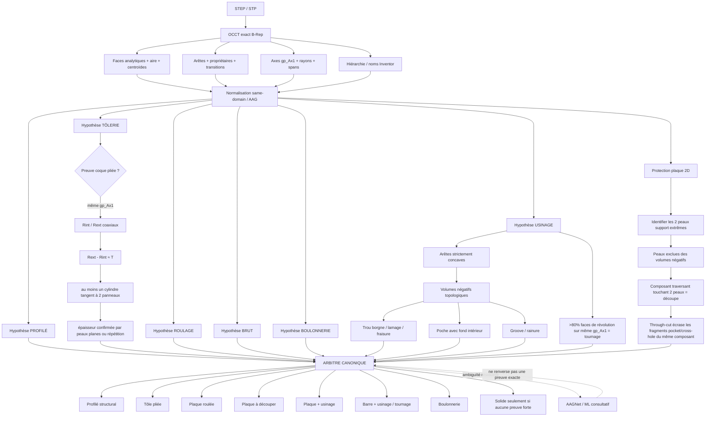

# NavoFlo V8.23.1 — Schéma d'analyse manufacturière

## Décision directrice

V8.23.1 traite **profilé, tôlerie, roulage, brut et usinage comme des hypothèses concurrentes basées sur le même B-Rep OCCT**. Une hypothèse rejetée peut rester dans les diagnostics, mais ne peut plus revenir par une autre couche et remplacer la décision gagnante.

## 1. Preuve physique d'un vrai pli

La relation `Rint + T = Rext` est une **preuve très forte**, mais pas une règle isolée suffisante.

Pour devenir une autorité de pliage, V8.23.1 demande conjointement :

1. cylindres intérieur et extérieur sur la **même ligne d'axe `gp_Ax1`**;
2. `|Rext - Rint - T|` dans la tolérance matière;
3. au moins un des cylindres est un vrai candidat de pli : il est tangent à **deux panneaux plans distincts**;
4. `T` est corroborée soit par les deux peaux planes, soit par plusieurs paires de plis répétant le même delta;
5. la preuve est évaluée avant de laisser une ressemblance dimensionnelle AISC décider.

Cette combinaison distingue une pièce fabriquée à la presse d'un W/C/L/U laminé. Un profilé structural possède des root/toe fillets, mais ils ne forment normalement pas une paire de peaux cylindriques coaxiales séparées exactement par l'épaisseur de la matière sur le même pli.

Exemples réels du corpus V8.23.1 :

- `25021600_502-00-22`: `23.8125 + 9.525 = 33.3375 mm`;
- `ST02-0005`: `2.667 + 2.667 = 5.334 mm`, répété aux 4 coins;
- `25021600_503-00-01`: `76.2 + 19.05 = 95.25 mm`, répété sur les plis.

## 2. Pourquoi une simple plaque ne doit pas devenir « usinage »

Une plaque laser a deux **peaux support physiques** : dessus et dessous. Les arêtes d'une ouverture traversante peuvent être numériquement qualifiées concaves selon l'orientation du B-Rep, mais le dessus/dessous ne sont jamais des fonds de poche.

V8.23.1 :

- retrouve les deux plans support extrêmes indépendamment de la fragmentation STEP;
- agrandit ces plans avec les groupes `sameDomainFaceIds`;
- interdit à toute arête touchant une peau support de faire entrer cette peau dans un volume négatif;
- exige qu'un fond de poche soit parallèle à la normale de la plaque et **situé à l'intérieur** de l'épaisseur;
- reconnaît les parois qui touchent les deux peaux comme `through-slot` / `through-profile`;
- supprime ensuite les fragments génériques `pocket-floor`, `cross-hole`, `one-sided-recess` ou `offset-bore` lorsque les mêmes faces sont déjà expliquées par un through-cut prouvé.

Ainsi une ligne de séparation / split-face SolidWorks ne peut plus devenir une poche simplement parce qu'elle fragmente une peau.

## 3. Usinage positif conservé

La protection des plaques ne désactive pas l'usinage réel. Les preuves suivantes restent autoritaires :

- `DescribeExactHole` borgne;
- `DescribeExactCompoundHole` pour lamage/fraisure;
- cylindre → cône/plan sur arêtes concaves internes;
- fond plan intérieur + parois concaves;
- rainure annulaire / groove par morphologie coaxiale;
- `DescribeExactChamfer` sur une face non-formante;
- tournage lorsque **>80%** des faces cylinder/cone/torus partagent la même ligne `gp_Ax1`.

## 4. Arbitre profilé vs tôle

Une correspondance AISC calculée peut rester dans `diagnostics.structuralProfile`. En V8.23.0, cette hypothèse rejetée pouvait accidentellement être passée au MRE et redevenir le brut final.

V8.23.1 introduit une séparation stricte :

- `code === structural-profile` = profilé autoritaire;
- vrai `pairedBendEvidence` = profil diagnostique **rejeté**, donc jamais transmis comme brut structural;
- les métadonnées Inventor explicites AISC + géométrie compatible restent une autorité forte pour les vrais W/C/L/U.

## 5. Fallback de robustesse

Pour une pièce de complexité normale, `manufacturing-face-info` complet reste la source canonique. Si cette passe complète retourne un échec générique, Navo3D exécute une seule passe indépendante `sheetmetal-face-info` et conserve uniquement une hypothèse **plus forte** : roulage, profilé prouvé ou coque de pliage prouvée.

Cette route vise notamment les pièces fortement perforées où les trous fragmentent les panneaux de tôle.

## 6. Contrat anti-régression V8.23.1

Le moteur doit simultanément conserver :

- vrais profilés `U2X1X3/16`, `L2X2X1/4`, `W6X20` comme profilés;
- `25021600_502-00-22` et `ST02-0005` comme tôles pliées malgré une ressemblance U;
- `25021600_503-00-01` comme tôle pliée;
- plaques laser oblongues / cadres comme **découpe seulement**, même sous un stress-test où les transitions sont toutes déclarées concaves;
- `ST01-0002` et les pucks ST04 comme pièces usinées / tournées;
- les poches, trous borgnes, lamages, fraisures, grooves et chanfreins exacts comme usinage.

Une modification future n'est valide que si tous les contrats historiques V8.20 → V8.23.1 passent ensemble.
